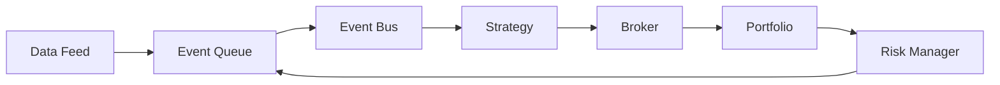

# QEngine Architecture

## Overview

QEngine is a state-of-the-art event-driven backtesting engine designed for machine learning-driven trading strategies. This document describes the internal architecture, design patterns, and implementation details specific to QEngine's simulation capabilities.

## Core Architecture

### Event-Driven Design

QEngine follows a pure event-driven architecture for realistic market simulation:



### Module Organization

```
qengine/
├── core/               # Core infrastructure
│   ├── clock.py        # Master time controller
│   ├── event_bus.py    # Event routing system
│   ├── events.py       # Event type definitions
│   └── types.py        # Core type definitions
├── data/               # Data management
│   ├── feed.py         # Abstract data feed
│   ├── parquet_feed.py # Parquet implementation
│   ├── csv_feed.py     # CSV implementation
│   └── schemas.py      # Data schemas
├── strategy/           # Strategy framework
│   ├── base.py         # Strategy ABC
│   ├── ml_strategy.py  # ML model integration
│   └── pit_data.py     # Point-in-time data
├── execution/          # Order execution
│   ├── broker.py       # Broker simulation with advanced models
│   ├── order.py        # Order types and lifecycle management
│   ├── slippage.py     # Slippage models (7 implementations)
│   ├── commission.py   # Commission models (9 implementations)
│   ├── market_impact.py # Market impact models (6 implementations)
│   └── corporate_actions.py # Corporate actions handling
├── portfolio/          # Portfolio management
│   ├── state.py        # Portfolio state
│   ├── positions.py    # Position tracking
│   └── accounting.py   # P&L calculation
├── risk/               # Risk management
│   ├── manager.py      # Risk controls
│   ├── limits.py       # Position limits
│   └── models.py       # Risk models
└── reporting/          # Output generation
    ├── reporter.py     # Report generator
    ├── metrics.py      # Performance metrics
    └── visualizer.py   # Visualization tools
```

## Event System Architecture

### Event Types Hierarchy

```python
class Event(ABC):
    """Base event class."""
    timestamp: datetime
    priority: int

class MarketEvent(Event):
    """Market data update - supports irregular timestamps."""
    asset_id: str
    data_type: MarketDataType  # BAR, TICK, etc.
    open: float
    high: float
    low: float
    close: float
    volume: int
    metadata: Dict[str, Any]  # For bar type info (volume, dollar, etc.)

class SignalEvent(Event):
    """Strategy signal."""
    asset_id: str
    signal_type: SignalType
    strength: float

class OrderEvent(Event):
    """Order request."""
    asset_id: str
    order_type: OrderType
    quantity: float

class FillEvent(Event):
    """Order execution with realistic costs."""
    asset_id: str
    executed_price: float
    executed_quantity: float
    commission: float
    slippage: float
    market_impact: float
```

### Event Bus Implementation

```python
class EventBus:
    """Central event routing system."""

    def __init__(self):
        self.subscribers = defaultdict(list)
        self.event_queue = PriorityQueue()

    def subscribe(self, event_type, handler):
        """Register event handler."""
        self.subscribers[event_type].append(handler)

    def publish(self, event):
        """Publish event to subscribers."""
        for handler in self.subscribers[type(event)]:
            handler(event)

    def process_events(self):
        """Process all queued events."""
        while not self.event_queue.empty():
            event = self.event_queue.get()
            self.publish(event)
```

## Clock and Time Management

### Master Clock Design

```python
class Clock:
    """Master time controller ensuring causality - handles irregular timestamps."""

    def __init__(self, start_time, end_time):
        self.current_time = start_time
        self.end_time = end_time
        self.subscribers = []

    def advance_to(self, timestamp):
        """Advance clock to specific time - supports irregular intervals."""
        if timestamp <= self.current_time:
            raise TemporalViolation("Cannot move backwards in time")

        self.current_time = timestamp
        self._notify_subscribers()

    def register_timer(self, callback, interval):
        """Register periodic callback."""
        self.subscribers.append((callback, interval))
```

### Irregular Timestamps Support

QEngine's event-driven architecture natively supports irregular timestamps, enabling backtesting on:

- **Volume Bars**: Events triggered by share volume thresholds
- **Dollar Bars**: Events triggered by dollar volume thresholds
- **Information Bars**: Events based on information flow (VPIN, order flow)
- **Tick Bars**: Events triggered by transaction count
- **Custom Bars**: Any event-driven aggregation logic

```python
class IrregularTimeProcessor:
    """Process events with any timestamp pattern."""

    def process_events(self, events):
        """Handle events regardless of timing regularity."""
        # Sort by timestamp - handles any irregular sequence
        sorted_events = sorted(events, key=lambda e: e.timestamp)

        for event in sorted_events:
            # Clock advances to exact event time
            self.clock.advance_to(event.timestamp)

            # Strategy receives event at natural market timing
            pit_data = self.data_manager.get_pit_data(event.timestamp)
            self.strategy.on_event(event, pit_data)

            # No artificial time grid imposed
```

### Point-in-Time Data Guarantees

```python
class PITData:
    """Point-in-time data view for strategies."""

    def __init__(self, data, current_time):
        self.data = data
        self.current_time = current_time
        self._view = self._create_view()

    def _create_view(self):
        """Create immutable PIT view."""
        # Only data available before current_time
        mask = self.data['timestamp'] <= self.current_time
        return self.data.filter(mask).clone()

    def __getitem__(self, key):
        """Read-only access to PIT data."""
        return self._view[key]

    def __setitem__(self, key, value):
        """Prevent modification."""
        raise PITViolation("Cannot modify point-in-time data")
```

## Data Feed Architecture

### Abstract Data Feed

```python
class DataFeed(ABC):
    """Abstract base for all data feeds."""

    @abstractmethod
    def get_next_event(self) -> Optional[Event]:
        """Get next market event."""
        pass

    @abstractmethod
    def peek_next_timestamp(self) -> Optional[datetime]:
        """Peek at next event time without consuming."""
        pass

    @property
    @abstractmethod
    def is_exhausted(self) -> bool:
        """Check if feed has more data."""
        pass
```

### Multi-Asset Feed Coordination

```python
class MultiAssetFeed:
    """Coordinate multiple asset feeds."""

    def __init__(self, feeds: Dict[str, DataFeed]):
        self.feeds = feeds
        self.heap = []  # Min-heap for time ordering
        self._initialize_heap()

    def get_next_event(self) -> Optional[Event]:
        """Get next event across all assets."""
        if not self.heap:
            return None

        timestamp, symbol, event = heappop(self.heap)

        # Refill from same feed
        if not self.feeds[symbol].is_exhausted:
            next_event = self.feeds[symbol].get_next_event()
            heappush(self.heap, (next_event.timestamp, symbol, next_event))

        return event
```

## Strategy Framework

### Strategy Lifecycle

```python
class Strategy(ABC):
    """Base strategy class."""

    def on_start(self, context):
        """Called once at start."""
        pass

    @abstractmethod
    def on_event(self, event: Event, pit_data: PITData):
        """Process event with PIT data."""
        pass

    def on_end(self, context):
        """Called once at end."""
        pass
```

### ML Strategy Integration

```python
class MLStrategy(Strategy):
    """Machine learning strategy wrapper."""

    def __init__(self, model, feature_pipeline):
        self.model = model
        self.feature_pipeline = feature_pipeline
        self.prediction_cache = {}

    def on_event(self, event: MarketEvent, pit_data: PITData):
        """Generate signals from ML model."""
        # Extract features from PIT data
        features = self.feature_pipeline.transform(pit_data)

        # Get model prediction
        prediction = self.model.predict(features)

        # Convert to signal
        if prediction > self.threshold:
            signal = SignalEvent(
                timestamp=event.timestamp,
                symbol=event.symbol,
                signal_type=SignalType.LONG,
                strength=prediction
            )
            return signal
```

## Execution Architecture

### Advanced Order Types

QEngine supports sophisticated order types for realistic simulation:

```python
class OrderType(Enum):
    """Comprehensive order type support."""
    MARKET = "market"
    LIMIT = "limit"
    STOP = "stop"
    STOP_LIMIT = "stop_limit"
    TRAILING_STOP = "trailing_stop"
    BRACKET = "bracket"  # Entry with stop-loss and take-profit
    OCO = "oco"  # One-Cancels-Other
```

### Slippage Models

Seven sophisticated slippage models for different market conditions:

```python
class SlippageModel(ABC):
    """Base class for slippage models."""

    @abstractmethod
    def calculate_fill_price(self, order, market_price) -> float:
        pass

# Available implementations:
# 1. NoSlippage - Perfect execution
# 2. FixedSlippage - Constant spread
# 3. PercentageSlippage - Proportional to price
# 4. LinearImpactSlippage - Proportional to volume
# 5. SquareRootSlippage - Almgren-Chriss scaling
# 6. VolumeShareSlippage - Based on market participation
# 7. AssetClassSlippage - Different rates by asset type
```

### Commission Models

Nine commission models covering different broker types:

```python
class CommissionModel(ABC):
    """Base class for commission models."""

    @abstractmethod
    def calculate(self, order, fill_quantity, fill_price) -> float:
        pass

# Available implementations:
# 1. NoCommission - Zero cost
# 2. FlatCommission - Fixed cost per trade
# 3. PercentageCommission - Percentage of notional
# 4. PerShareCommission - Cost per share
# 5. TieredCommission - Volume-based tiers
# 6. MakerTakerCommission - Exchange-style rebates
# 7. AssetClassCommission - Different rates by asset
# 8. InteractiveBrokersCommission - IB pricing model
# 9. RobinhoodCommission - Zero commission with SEC fees
```

### Market Impact Models

Six market impact models for realistic price simulation:

```python
class MarketImpactModel(ABC):
    """Base class for market impact models."""

    @abstractmethod
    def calculate_impact(self, order, fill_quantity, market_price, timestamp):
        return permanent_impact, temporary_impact

# Available implementations:
# 1. NoMarketImpact - Zero impact
# 2. LinearMarketImpact - Linear volume scaling
# 3. AlmgrenChrissImpact - Square-root permanent, linear temporary
# 4. PropagatorImpact - Bouchaud propagation model
# 5. IntraDayMomentum - Momentum-based impact
# 6. ObizhaevWangImpact - Order book dynamics
```

### Corporate Actions Processing

Comprehensive corporate actions handling:

```python
class CorporateActionProcessor:
    """Process corporate actions with position adjustments."""

    def process_actions(self, as_of_date, positions, orders, cash):
        """Handle all corporate actions as of date."""
        # Automatically processes:
        # - Cash dividends (cash distribution)
        # - Stock splits (position/order adjustments)
        # - Stock dividends (additional shares)
        # - Mergers (cash/stock consideration)
        # - Spin-offs (new asset distribution)
        # - Symbol changes (identifier updates)
        return updated_positions, updated_orders, updated_cash, notifications

# Supported corporate actions:
# 1. CashDividend - Automatic cash payments
# 2. StockSplit - Position and order adjustments
# 3. StockDividend - Additional share distribution
# 4. Merger - Cash and/or stock consideration
# 5. SpinOff - Distribution of new company shares
# 6. SymbolChange - Asset identifier updates
# 7. RightsOffering - Rights distribution (notification)
```

### Integrated Broker Simulation

```python
class SimulationBroker:
    """Advanced broker simulation with all models."""

    def __init__(
        self,
        commission_model=None,
        slippage_model=None,
        market_impact_model=None,
        corporate_action_processor=None,
    ):
        self.commission_model = commission_model
        self.slippage_model = slippage_model
        self.market_impact_model = market_impact_model
        self.corporate_actions = corporate_action_processor

    def execute_order(self, order, market_price, timestamp):
        """Execute with realistic costs and market effects."""
        # Apply market impact to price
        impacted_price = self._apply_market_impact(order, market_price, timestamp)

        # Calculate fill price with slippage
        fill_price = self._apply_slippage(order, impacted_price)

        # Calculate commission
        commission = self._calculate_commission(order, fill_price)

        # Update market impact state
        self._update_market_impact(order, fill_price, timestamp)

        # Process any pending corporate actions
        self._process_corporate_actions(timestamp)

        return FillEvent(...)
```

## Portfolio Management

### Portfolio State Management

```python
class PortfolioState:
    """Centralized portfolio state."""

    def __init__(self, initial_capital):
        self.cash = initial_capital
        self.positions = {}  # symbol -> Position
        self.pending_orders = {}
        self.historical_positions = []

    def update_position(self, fill: FillEvent):
        """Update position from fill."""
        symbol = fill.symbol

        if symbol not in self.positions:
            self.positions[symbol] = Position(symbol)

        position = self.positions[symbol]
        position.update(fill)

        # Update cash
        self.cash -= fill.executed_price * fill.executed_quantity
        self.cash -= fill.commission

    def mark_to_market(self, market_prices: Dict[str, float]):
        """Update portfolio value."""
        total_value = self.cash

        for symbol, position in self.positions.items():
            if symbol in market_prices:
                position.mark_to_market(market_prices[symbol])
                total_value += position.market_value

        return total_value
```

### Position Tracking

```python
class Position:
    """Track individual position."""

    def __init__(self, symbol):
        self.symbol = symbol
        self.quantity = 0
        self.avg_price = 0
        self.realized_pnl = 0
        self.unrealized_pnl = 0

    def update(self, fill: FillEvent):
        """Update position from fill."""
        if self.quantity == 0:
            # New position
            self.quantity = fill.executed_quantity
            self.avg_price = fill.executed_price
        elif sign(self.quantity) == sign(fill.executed_quantity):
            # Adding to position
            total_cost = self.quantity * self.avg_price + \
                        fill.executed_quantity * fill.executed_price
            self.quantity += fill.executed_quantity
            self.avg_price = total_cost / self.quantity
        else:
            # Reducing/closing position
            self.realized_pnl += (fill.executed_price - self.avg_price) * \
                                 min(abs(self.quantity), abs(fill.executed_quantity))
            self.quantity += fill.executed_quantity
```

## Risk Management Architecture

### Risk Manager

```python
class RiskManager:
    """Centralized risk controls."""

    def __init__(self, config):
        self.max_position_size = config.get('max_position_size')
        self.max_portfolio_risk = config.get('max_portfolio_risk')
        self.stop_loss_pct = config.get('stop_loss_pct')

    def check_order(self, order: OrderEvent, portfolio: PortfolioState) -> bool:
        """Pre-trade risk checks."""
        # Position size limit
        if abs(order.quantity) > self.max_position_size:
            return False

        # Portfolio risk limit
        portfolio_risk = self._calculate_portfolio_risk(portfolio)
        if portfolio_risk > self.max_portfolio_risk:
            return False

        return True

    def generate_risk_orders(self, portfolio: PortfolioState,
                           market_data: Dict) -> List[OrderEvent]:
        """Generate risk management orders (stops, etc.)."""
        orders = []

        for symbol, position in portfolio.positions.items():
            # Check stop loss
            if position.unrealized_pnl_pct < -self.stop_loss_pct:
                orders.append(self._create_stop_order(symbol, position))

        return orders
```

## Performance Optimization

### Vectorized Calculations

```python
class VectorizedMetrics:
    """Optimized metric calculations using Polars."""

    @staticmethod
    def calculate_returns(prices: pl.Series) -> pl.Series:
        """Vectorized return calculation."""
        return prices.pct_change()

    @staticmethod
    def calculate_drawdown(prices: pl.Series) -> pl.Series:
        """Vectorized drawdown calculation."""
        cummax = prices.cummax()
        return (prices - cummax) / cummax
```

### Memory Management

```python
class MemoryEfficientBacktest:
    """Memory-optimized backtesting."""

    def __init__(self, chunk_size=10000):
        self.chunk_size = chunk_size
        self.results_buffer = []

    def run_chunked(self, data_feed, strategy):
        """Process data in chunks."""
        chunk = []

        while not data_feed.is_exhausted:
            event = data_feed.get_next_event()
            chunk.append(event)

            if len(chunk) >= self.chunk_size:
                self._process_chunk(chunk, strategy)
                chunk = []

        if chunk:
            self._process_chunk(chunk, strategy)
```

## Integration Points

### Input from QFeatures/QEval

```python
class MLBacktest:
    """Integrate ML models from upstream."""

    def __init__(self, features_df, model, strategy_class):
        # Features from QFeatures
        self.features = features_df

        # Model validated by QEval
        self.model = model

        # Strategy implementation
        self.strategy = strategy_class(model)

    def run(self):
        """Execute backtest with ML strategy."""
        feed = DataFeed.from_features(self.features)
        engine = BacktestEngine(feed, self.strategy)
        return engine.run()
```

### Output Contract

```python
class BacktestResults:
    """Standardized output format."""

    def __init__(self):
        self.trades = []  # List of executed trades
        self.positions = []  # Position snapshots
        self.portfolio_value = []  # Portfolio value over time
        self.metrics = {}  # Performance metrics

    def to_dataframe(self) -> pl.DataFrame:
        """Export as Polars DataFrame."""
        return pl.DataFrame({
            'timestamp': [t.timestamp for t in self.trades],
            'symbol': [t.symbol for t in self.trades],
            'side': [t.side for t in self.trades],
            'price': [t.price for t in self.trades],
            'quantity': [t.quantity for t in self.trades],
            'pnl': [t.pnl for t in self.trades]
        })
```

## Testing Architecture

### Simulation Verification

```python
class SimulationVerifier:
    """Verify simulation correctness."""

    def verify_temporal_consistency(self, events):
        """Ensure time never goes backward."""
        timestamps = [e.timestamp for e in events]
        assert all(t1 <= t2 for t1, t2 in zip(timestamps, timestamps[1:]))

    def verify_portfolio_consistency(self, trades, positions):
        """Ensure portfolio math is correct."""
        calculated_position = self._calculate_position_from_trades(trades)
        assert calculated_position == positions[-1]

    def verify_no_lookahead(self, strategy_decisions, market_data):
        """Ensure no future data was used."""
        for decision in strategy_decisions:
            available_data = market_data[market_data.timestamp <= decision.timestamp]
            assert decision.features_used.issubset(available_data.columns)
```

## Future Enhancements

### Planned Features

1. **Live Trading Bridge**: Adapter for live broker connections
2. **Distributed Backtesting**: Multi-core/cluster execution
3. **Advanced Order Types**: Iceberg, TWAP, VWAP (basic order types ✅ completed)
4. **Market Microstructure**: Order book simulation
5. **Multi-Asset Classes**: Options, futures, crypto native support

### Recently Completed Features ✅

1. **Advanced Order Types**: Stop, Stop-Limit, Trailing Stop, Bracket orders
2. **Realistic Execution Models**: 7 slippage models, 9 commission models, 6 market impact models
3. **Corporate Actions**: Comprehensive handling of dividends, splits, mergers, spin-offs
4. **Irregular Timestamps**: Native support for volume/dollar/information bars

### Extension Points

```python
class ExtensionRegistry:
    """Plugin system for extensions."""

    def register_broker(self, name, broker_class):
        """Register custom broker implementation."""
        pass

    def register_data_feed(self, name, feed_class):
        """Register custom data feed."""
        pass

    def register_risk_model(self, name, model_class):
        """Register custom risk model."""
        pass
```
