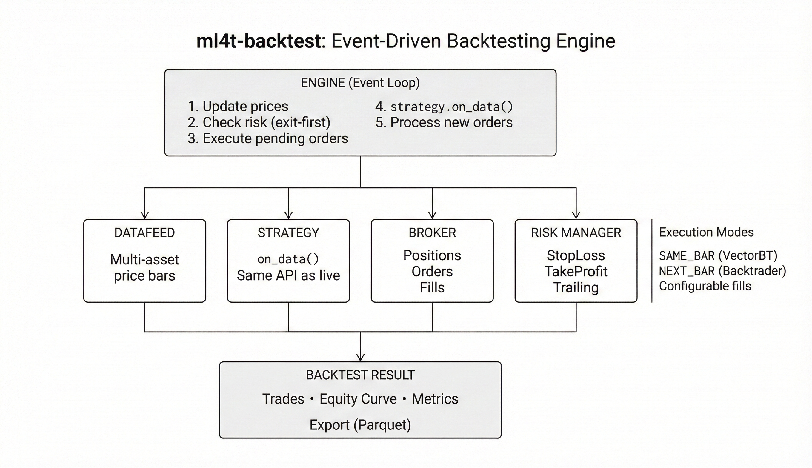

# ml4t-backtest

[](https://www.python.org/downloads/)
[](https://pypi.org/project/ml4t-backtest/)
[](https://opensource.org/licenses/MIT)

Event-driven backtesting engine for quantitative trading strategies with realistic execution modeling.

## Part of the ML4T Library Ecosystem

This library is one of five interconnected libraries supporting the machine learning for trading workflow described in [Machine Learning for Trading](https://mlfortrading.io):


Each library addresses a distinct stage: data infrastructure, feature engineering, signal evaluation, strategy backtesting, and live deployment.

## What This Library Does

Backtesting requires accurate simulation of order execution, position tracking, and risk management. ml4t-backtest provides:

- Event-driven architecture with point-in-time correctness (no look-ahead bias)
- Exit-first order processing matching real broker behavior
- Configurable execution modes (same-bar or next-bar fills)
- Position-level risk rules (stop-loss, take-profit, trailing stops)
- Portfolio-level constraints (max positions, drawdown limits)
- Cash and margin account policies

The same Strategy class used in backtesting works unchanged in ml4t-live for production deployment.



## Installation

```bash
pip install ml4t-backtest
```

## Quick Start

```python
from ml4t.backtest import Engine, Strategy, BacktestConfig, DataFeed
from ml4t.backtest.risk import StopLoss, TakeProfit, RuleChain

class TrendFollowing(Strategy):
    def __init__(self, fast=10, slow=30):
        self.fast = fast
        self.slow = slow

    def on_data(self, timestamp, data, context, broker):
        close = data["close"]
        fast_ma = close.rolling(self.fast).mean().iloc[-1]
        slow_ma = close.rolling(self.slow).mean().iloc[-1]

        position = broker.get_position("SPY")

        if fast_ma > slow_ma and position is None:
            broker.submit_order("SPY", quantity=100, side="BUY")
        elif fast_ma < slow_ma and position is not None:
            broker.close_position("SPY")

config = BacktestConfig(
    initial_cash=100_000,
    commission_rate=0.001,
)

feed = DataFeed(price_data)
engine = Engine(feed, TrendFollowing(), config)
result = engine.run()

print(f"Total Return: {result.total_return:.2%}")
print(f"Sharpe Ratio: {result.metrics['sharpe_ratio']:.2f}")
```

## Risk Management

Position-level exit rules:

```python
from ml4t.backtest.risk import StopLoss, TakeProfit, TrailingStop, RuleChain

class MyStrategy(Strategy):
    def on_start(self, broker):
        broker.set_position_rules(RuleChain([
            StopLoss(pct=0.05),
            TakeProfit(pct=0.15),
            TrailingStop(pct=0.03),
        ]))
```

Portfolio-level controls:

```python
from ml4t.backtest.risk import MaxPositions, MaxDrawdown, DailyLossLimit
```

## Execution Modes

```python
from ml4t.backtest import ExecutionMode, StopFillMode

# Same-bar fills (VectorBT style)
config = BacktestConfig(
    execution_mode=ExecutionMode.SAME_BAR,
    stop_fill_mode=StopFillMode.STOP_PRICE,
)

# Next-bar fills (Backtrader style)
config = BacktestConfig(
    execution_mode=ExecutionMode.NEXT_BAR,
    stop_fill_mode=StopFillMode.STOP_PRICE,
)
```

## Commission and Slippage

```python
from ml4t.backtest import PercentCommission, PercentSlippage

config = BacktestConfig(
    commission_model=PercentCommission(rate=0.001),
    slippage_model=PercentSlippage(rate=0.0005),
)
```

## Multi-Asset Support

```python
class RankingStrategy(Strategy):
    def on_data(self, timestamp, data, context, broker):
        returns = data["close"].pct_change(20)
        ranked = returns.iloc[-1].sort_values(ascending=False)

        # Long top 10
        for asset in ranked.head(10).index:
            if broker.get_position(asset) is None:
                broker.submit_order(asset, quantity=100, side="BUY")
```

## Validation

The library is validated against VectorBT Pro, Backtrader, and Zipline:

- 119,000+ trades verified trade-by-trade across frameworks
- 500 assets x 10 years (2,520 bars) stress testing
- 100% PnL match on common execution scenarios

See [validation/README.md](validation/README.md) for test methodology.

## Technical Characteristics

- **Event-driven**: Each bar processes sequentially with exit-first logic
- **Point-in-time**: No access to future data within strategy callbacks
- **Configurable fills**: Match behavior of different backtesting frameworks
- **Parquet export**: Results serializable for analysis with ml4t-diagnostic

## Related Libraries

- **ml4t-data**: Market data acquisition and storage
- **ml4t-engineer**: Feature engineering and technical indicators
- **ml4t-diagnostic**: Signal evaluation and statistical validation
- **ml4t-live**: Live trading with broker integration

## Development

```bash
git clone https://github.com/applied-ai/ml4t-backtest.git
cd ml4t-backtest
uv sync
uv run pytest tests/ -q
uv run ty check
```

## Known Limitations

See [LIMITATIONS.md](LIMITATIONS.md) for documented assumptions:

- Partial fills not supported (all-or-nothing)
- No intrabar stop simulation (uses bar OHLC)
- Calendar overnight sessions require configuration

## License

MIT License - see [LICENSE](LICENSE) for details.
