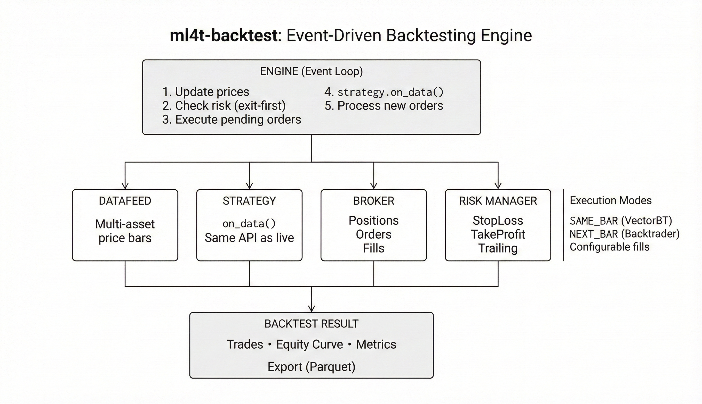

# ml4t-backtest

[](https://www.python.org/downloads/)
[](https://pypi.org/project/ml4t-backtest/)
[](https://opensource.org/licenses/MIT)

Event-driven backtesting engine for quantitative trading strategies with realistic execution modeling.

## Part of the ML4T Library Ecosystem

This library is one of six interconnected libraries supporting the machine learning for trading workflow described in [Machine Learning for Trading](https://ml4trading.io):


Together they cover data infrastructure, feature engineering, modeling, signal evaluation, strategy backtesting, and live deployment.

## What This Library Does

Backtesting requires accurate simulation of order execution, position tracking, and risk management. ml4t-backtest provides:

- Event-driven architecture with point-in-time correctness (no look-ahead bias)
- Exit-first order processing matching real broker behavior
- Configurable execution modes (same-bar or next-bar fills)
- Quote-aware execution and marking with `price`, bid, ask, midpoint, and side-aware sources
- Position-level risk rules (stop-loss, take-profit, trailing stops)
- Portfolio-level constraints (max positions, drawdown limits)
- Cash, margin, and crypto account policies
- First-class trade, fill, and portfolio-state export for audit and downstream analysis
- 40+ behavioral knobs for framework-specific parity

The same Strategy class used in backtesting works unchanged in ml4t-live for production deployment.



## Installation

```bash
pip install ml4t-backtest
```

## Quick Start

<!-- ml4t-doc-test: readme-quickstart -->
```python
from datetime import datetime

import polars as pl
from ml4t.backtest import Engine, Strategy, BacktestConfig, DataFeed

class SignalStrategy(Strategy):
    def on_data(self, timestamp, data, context, broker):
        for asset, bar in data.items():
            signal = bar.get("signals", {}).get("prediction", 0)
            price = bar.get("price", bar.get("close", 0))
            position = broker.get_position(asset)

            if position is None and signal > 0.5:
                shares = (broker.get_account_value() * 0.10) / price
                if shares > 0:
                    broker.submit_order(asset, shares)
            elif position is not None and signal < -0.5:
                broker.close_position(asset)

timestamps = [datetime(2024, 1, day) for day in (2, 3, 4, 5)]
prices = pl.DataFrame(
    {
        "timestamp": timestamps,
        "asset": ["AAPL"] * 4,
        "close": [100.0, 101.0, 103.0, 102.0],
    }
)
signals = pl.DataFrame(
    {
        "timestamp": timestamps,
        "asset": ["AAPL"] * 4,
        "prediction": [1.0, 1.0, -1.0, -1.0],
    }
)

config = BacktestConfig(initial_cash=100_000)
feed = DataFeed(prices_df=prices, signals_df=signals)
engine = Engine(feed, SignalStrategy(), config)
result = engine.run()

print(f"Total Return: {result.metrics['total_return_pct']:.2f}%")
print(f"Sharpe Ratio: {result.metrics['sharpe']:.2f}")
print(result.to_fills_dataframe().head())
```

Each `Engine` instance is single-use. Create a new instance for every independent run.

`bar["price"]` follows `FeedSpec.price_col` when you provide one, so the same strategy works for close-based bars and quote-aware feeds.

## Risk Management

Position-level exit rules:

```python
from ml4t.backtest import Strategy, StopLoss, TakeProfit, TrailingStop, RuleChain

class MyStrategy(Strategy):
    def on_start(self, broker):
        broker.set_position_rules(RuleChain([
            StopLoss(pct=0.05),
            TakeProfit(pct=0.15),
            TrailingStop(pct=0.03),
        ]))
```

Portfolio-level controls:

```python
from ml4t.backtest.risk.portfolio.limits import MaxDrawdownLimit, DailyLossLimit
```

## Framework Profiles

Built-in profiles configure the behavioral semantics used by major backtesting frameworks:

```python
from ml4t.backtest import BacktestConfig

# Match VectorBT behavior (same-bar close fills, fractional shares)
config = BacktestConfig.from_preset("vectorbt")

# Match Backtrader behavior (next-bar open fills, integer shares)
config = BacktestConfig.from_preset("backtrader")

# Match Zipline behavior (next-bar open fills, integer shares, per-share commission)
config = BacktestConfig.from_preset("zipline")

# Match QuantConnect LEAN behavior (same-bar close fills, integer shares)
config = BacktestConfig.from_preset("lean")

# Conservative production settings (higher costs, cash buffer)
config = BacktestConfig.from_preset("realistic")
```

Each profile sets 40+ behavioral knobs, including fill timing, execution price, share type,
commission model, and order processing. Current exact-match evidence appears below.

## Execution Modes

```python
from ml4t.backtest import ExecutionMode, StopFillMode

# Same-bar fills (VectorBT style)
config = BacktestConfig(
    execution_mode=ExecutionMode.SAME_BAR,
    stop_fill_mode=StopFillMode.STOP_PRICE,
)

# Next-bar fills (Backtrader style)
config = BacktestConfig(
    execution_mode=ExecutionMode.NEXT_BAR,
    stop_fill_mode=StopFillMode.STOP_PRICE,
)
```

## Quote-Aware Execution

```python
from ml4t.backtest import BacktestConfig, DataFeed
from ml4t.backtest.config import ExecutionPrice

feed = DataFeed(
    prices_df=quotes,
    price_col="mid_price",
    bid_col="bid",
    ask_col="ask",
    bid_size_col="bid_size",
    ask_size_col="ask_size",
)

config = BacktestConfig(
    execution_price=ExecutionPrice.QUOTE_SIDE,
    mark_price=ExecutionPrice.QUOTE_SIDE,
)
```

With `QUOTE_SIDE`, buys fill at the ask and sells fill at the bid when quotes are present. `mark_price` is configured separately, so you can trade on one source and mark the book on another.

Quote-aware runs also preserve the microstructure context in the result surface:

- `result.to_fills_dataframe()` includes bid/ask/midpoint/spread/size context
- `result.to_trades_dataframe()` includes nullable entry/exit quote summaries
- `result.to_portfolio_state_dataframe()` reflects the configured mark source over time
- `result.to_predictions_dataframe()` preserves the raw model/input surface for downstream
  diagnostics

## Reproducible Config Snapshots

`BacktestConfig` is also the serializable backtest preset surface. You can keep
input configs sparse, then persist the fully resolved config that actually ran.

```python
config = BacktestConfig.from_yaml("config/my_backtest.yaml")
result = Engine(feed, strategy, config).run()

resolved_config = result.config.to_dict()
runtime_spec = result.to_spec_dict()
written = result.to_parquet("results/run_001")
```

The exported result directory includes:

- `config.yaml` for the replayable resolved config payload
- `spec.yaml` for the richer runtime snapshot with library version and realized run window

Use top-level `feed` in `BacktestConfig` for generic feed semantics and top-level
`metadata` for user-defined provenance like input paths or strategy ids.

## Commission and Slippage

```python
from ml4t.backtest import BacktestConfig, CommissionType
from ml4t.backtest.config import SlippageType, SpreadConvention

config = BacktestConfig(
    commission_rate=0.001,         # 10 bps percentage
    slippage_rate=0.0005,          # 5 bps slippage
    stop_slippage_rate=0.001,      # Additional slippage for stop exits
)

# Or per-share (Interactive Brokers style)
config = BacktestConfig(
    commission_type=CommissionType.PER_SHARE,
    commission_per_share=0.005,
    commission_minimum=1.0,
)

# Or bar-only spread approximation in currency units
config = BacktestConfig(
    slippage_type=SlippageType.SPREAD,
    slippage_spread=0.02,
    slippage_spread_convention=SpreadConvention.FULL_SPREAD,
)
```

## Multi-Asset Rebalancing

```python
from ml4t.backtest import Strategy, TargetWeightExecutor, RebalanceConfig

class WeightStrategy(Strategy):
    def __init__(self):
        self.executor = TargetWeightExecutor(RebalanceConfig(
            min_trade_value=100,    # Optional: skip tiny dollar trades
            min_weight_change=0.01, # Optional: skip tiny weight changes
        ))
        self.bar_count = 0

    def on_data(self, timestamp, data, context, broker):
        self.bar_count += 1
        if self.bar_count % 21 != 1:  # Monthly rebalance
            return

        # ML predictions → portfolio weights
        weights = {}
        for asset, bar in data.items():
            signal = bar.get("signals", {}).get("prediction", 0)
            if signal and signal > 0:
                weights[asset] = signal
        if weights:
            total = sum(weights.values())
            weights = {a: w / total for a, w in weights.items()}
            self.executor.execute(weights, data, broker)
```

`RebalanceConfig` defaults both `min_trade_value` and `min_weight_change` to
`0.0`, so these filters are opt-in.

`BacktestConfig()` defaults to neutral costs: `commission_type=NONE` and
`slippage_type=NONE`. Broker-specific fee models and synthetic slippage are
opt-in.

## Cross-Framework Validation

Profiles configure framework-specific execution behavior. The generated table below reports only
claims supported by the retained release-candidate evidence.

<!-- parity-claims:start -->
<!-- Generated by validation/generate_parity_claims.py. Do not edit by hand. -->

Scenario claims use the retained release-candidate matrix. "Exact" appears only when every required scenario has zero canonical gap.

| Profile | Pinned framework | Required scenarios | Evidence |
|---|---|---:|---|
| `vectorbt_strict` | [VectorBT Pro 2025.12.31](https://github.com/polakowo/vectorbt.pro) | 16/16 exact | [scenario evidence](https://github.com/ml4t/backtest/blob/main/validation/CORRECTNESS_RESULTS.json) |
| `vectorbt` | [VectorBT OSS 0.28.2](https://pypi.org/project/vectorbt/0.28.2/) | 15/15 exact | [scenario evidence](https://github.com/ml4t/backtest/blob/main/validation/CORRECTNESS_RESULTS.json) |
| `backtrader_strict` | [Backtrader 1.9.78.123](https://pypi.org/project/backtrader/1.9.78.123/) | 16/16 exact | [scenario evidence](https://github.com/ml4t/backtest/blob/main/validation/CORRECTNESS_RESULTS.json) |
| `zipline_strict` | [Zipline Reloaded 3.1.1](https://pypi.org/project/zipline-reloaded/3.1.1/) | 15/15 exact | [scenario evidence](https://github.com/ml4t/backtest/blob/main/validation/CORRECTNESS_RESULTS.json) |

Large-scale claims are published only when a retained workload has zero canonical gap.

| Profile | Pinned framework | Compared | Trade gap | Terminal value | Evidence |
|---|---|---:|---:|---:|---|
| `vectorbt_strict` | VectorBT Pro 2025.12.31 (`1305a1e19743`) | 225,844 trades | 0 | 685179.007330 | [large-scale evidence](https://github.com/ml4t/backtest/blob/main/validation/vectorbt_pro/large_scale_parity.json) |

No large-scale claim is published for Backtrader, Zipline, VectorBT OSS, or LEAN without a passing retained artifact.
<!-- parity-claims:end -->

See [validation/README.md](validation/README.md) for methodology and detailed results.

Release-gate commands:

```bash
# Fast parity contract gate (scenario 01 across vectorbt/backtrader/zipline)
ML4T_COMPARISON_INPROC=1 uv run pytest tests/contracts/test_cross_engine_contracts.py -q

# Full correctness runner (selected scenarios)
python validation/run_all_correctness.py --framework vectorbt_oss --scenarios 01,03,05,09
python validation/run_all_correctness.py --framework backtrader --scenarios 01,03,05,09
python validation/run_all_correctness.py --framework zipline --scenarios 01,03,05,09
```

## Performance

Release performance evidence covers deterministic single-asset, 250-asset daily, quote-aware,
rebalance, and partial-fill workloads. Each workload runs three times in a fresh child process.
The 250-asset workload periodically enters and exits a 50-position portfolio.
The evidence separates setup from `Engine.run()`, measures peak RSS over the whole child process,
reports runtime and memory sample spread, and verifies retained financial-output checksums and
counts. The dedicated instrument-free hotpath benchmark enforces the runtime regression limit.

Run the release baselines and the instrument-free feed regression check locally:

```bash
uv run python validation/performance_baseline.py --output release-performance-evidence.json
uv run pytest tests/benchmark/test_hotpath_benchmarks.py::test_optimized_feed_runtime_vs_legacy_baseline --no-cov
```

Workload definitions and expected checksums are retained in
`validation/performance_baselines.json`. The project does not publish hardware-dependent runtime,
throughput, memory, or cross-framework ratios as stable claims.

## Documentation

- [Getting Started](docs/getting-started/quickstart.md) — your first backtest
- [Data Feed](docs/user-guide/data-feed.md) — `price_col`, quote columns, and feed wiring
- [Strategies](docs/user-guide/strategies.md) — strategy interface and templates
- [Stateful Strategies](docs/user-guide/stateful-strategies.md) — advanced event-driven patterns (Kelly sizing, pairs trading, circuit breakers)
- [Execution Semantics](docs/user-guide/execution-semantics.md) — fill timing, ordering, stops
- [Configuration](docs/user-guide/configuration.md) — 40+ behavioral knobs
- [Risk Management](docs/user-guide/risk-management.md) — stops, trails, portfolio limits
- [Rebalancing](docs/user-guide/rebalancing.md) — weight-based portfolio management
- [Results & Analysis](docs/user-guide/results.md) — trades, fills, equity, and Parquet export
- [Market Impact](docs/user-guide/market-impact.md) — commission, slippage, and impact models
- [Profiles](docs/user-guide/profiles.md) — framework parity presets

## Technical Characteristics

- **Event-driven**: Each bar processes sequentially with configurable order sequencing
- **Point-in-time bar data**: Per-bar callbacks receive the current bar; `on_prepare` receives only the timestamp sequence and resolved config
- **Configurable fills**: Match behavior of different backtesting frameworks
- **Quote-aware**: Optional bid/ask/mid/size caches with side-aware market fills
- **Parquet export**: Trades, fills, equity, daily P&L, and config are serializable
- **Type-safe**: 0 type diagnostics (ty/Astral), full type annotations

## Related Libraries

- **ml4t-data**: Market data acquisition and storage
- **ml4t-engineer**: Feature engineering and technical indicators
- **ml4t-diagnostic**: Signal evaluation and statistical validation
- **ml4t-live**: Live trading with broker integration

## Development

```bash
git clone https://github.com/ml4t/backtest.git
cd backtest
uv sync
uv run pytest tests/ -q
uv run ty check
```

## Known Limitations

See [LIMITATIONS.md](LIMITATIONS.md) for documented assumptions:

- Bar data cannot identify the path or queue order of intrabar events
- Corporate actions, borrow costs, taxes, and currency conversion are not modeled
- The pre-stable strategy lifecycle still depends on the shared `ml4t-live` contract

## License

MIT License - see [LICENSE](LICENSE) for details.
